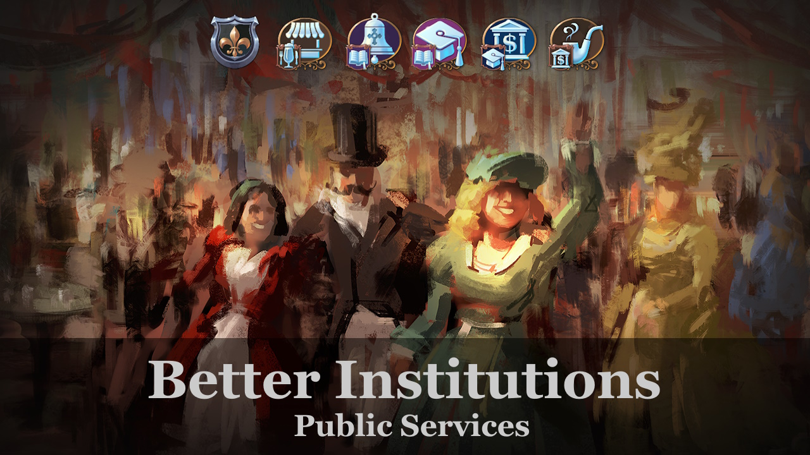

# Better Institutions - Services (BETA VERSION)

## Requirements

The mod should work without any DLC.

## Content

A simple Better Institution extension aimed at providing more public/services buildings (churches, schools, banks, etc.) at all existing population levels.

## Roadmap

It will possibly include the New World, Enbesa and even the Arctic in a second phase.

**Your feedback will be greatly appreciated!** You can also send me suggestions on this topic from the Anno modding discord!

## Known Issues

- Some buildings are still WIP