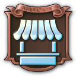

# Services
 **Trade Fair**
-

Works like a market, but slighly larger. Includes the best beer stand in town. Suits well in your medium cities. 
- Provides to your residences:
  

    
    
  

- Unlock at:
  

     500 workers
  

 **Religious School**
-

For these small towns that also needs education, why not ask the Church to take charge? 
- Provides to your residences:
  

    
    
  

- Unlock at:
  

     500 workers
  

 **Academy**
-
A prestigious academy. All students will become engineers or at least, grand inventors.

- Provides to your residences:
  

    
    
  

- Unlock at:
  

     500 artisans
  

 **Business School**
-
The crème de la crème of commerce. Ideal for your major cities and capitals. It will train the next generation of economists, bankers and investors.

- Provides to your residences:
  

    
    
  

- Unlock at:
  

     1 investor
  

 **Stock Exchange**
-
A strategic location for the future of economics. It smells of money and cigars.

- Provides to your residences:
  

    
    
  

- Unlock at:
  

     750 investors
  

