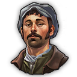

 **City Fire Department**
-

A small fire department, for a small city.

- Provides to your residences:
  

     Fire Surveillance
  

- Unlock at:
  

     500 workers
  

 **Mine Rescue Station**
-
A dedicated rescue centre for your mines. The mine rescue workers will ensure galleries are secure.

- Provides to your mines:
  

    <ul>
      <li> Fire Surveillance</li>
      <li> Productivity Enhanced</li>
      <li> Fire Risk Reduction</li>
      <li> Explosion Risk Reduction</li>
    </ul>
  

- Unlock at:
  

     500 workers
  

  
 **Farm Fire Brigade**
-
A dedicated rescue centre for your farms. Some liaison officers visit farms to check fire safety standards.

- Provides to your farms:
  

    <ul>
      <li> Fire Surveillance</li>
      <li> Modules reduction</li>
    </ul>
  

- Unlock at:
  

     500 workers
  

 **Metropolitan Fire Department**
-

A larger fire brigade dedicated for larger cities. Firefighters are more implicated to the life of the city.

- Provides to your residences:
  

    <ul>
      <li> Fire Surveillance</li>
      <li> Hapiness</li>
      <li> Fire Risk Reduction</li>
    </ul>
  

- Unlock at:
  

     1 artisan
  

  **Sailors Fire Brigade**
-
These sailors are specialized in harbor fire fighting. They can be affected in harbor repair crane during peace times, and to the maintenance of harbor defences in war times.

- Provides to your harbor:
  

    <ul>
      <li>(Coastal) Fire Surveillance</li>
      <li> Morale boost</li>
      <li> Faster and larger reparation area</li>
    </ul>
  

- Unlock at:
  

     1 artisan
  

 **Main Fire Department**
-
Located in downtown, this building train veteran firefighters. Due to the number of incidents, they work with better equipment, and will also sensibilize the population to fire and health risks.

- Provides to your residences:
  

    <ul>
      <li> Fire Surveillance</li>
      <li> Happiness</li>
      <li> Fire Risk Reduction</li>
      <li> Alcohol consumption reduction</li>
    </ul>
  

- Unlock at:
  

     750 engineers
  

 **Park Ranger**
-
These rangers are the forest guards. They will patrol to avoid forest fire, and control animal population.

- Provides to your forestry building:
  

    <ul>
      <li> Fire Surveillance</li>
      <li>  Productivity Enhanced</li>
    </ul>
  

- Unlock at:
  

     1 investor
  

  
 **Industrial Fire Department**
-
Mainly located in industrial districts, these fire department are specialized to fight heavy industry fires and hazards. 

- Provides to your industry building:
  

    <ul>
      <li> Fire Surveillance</li>
      <li> Productivity Reduction</li>
      <li> Fire Risk Reduction</li>
      <li> Explosion Risk Reduction</li>
    </ul>
  

- Unlock at:
  

     1 investor
  

  