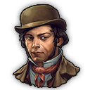

 **Small Sheriff Office**
-

A small sheriff office, for a small city.

- Provides to your residences:
  

     Law Enforcement surveillance (Sheriff)
  

- Unlock at:
  

     500 workers
  

  
 **Municipal Police**
-

A municipal police, for your city.

- Provides to your residences:
  

     Law Enforcement surveillance (Police)
  

- Unlock at:
  

     500 workers
  

 **Municipal Prison**
-

A municipal prison, for your city.

- Provides to your residences:
  

    <ul>
      <li> Alcohol consumption reduction</li>
      <li> Happiness</li>
      <li> Workforce reduction</li>
    </ul>
  

- Unlock at:
  

     500 workers
  

 **Metropolitan Police Department**
-

A police station for your medium-sized towns. Can carry out mounted patrols to increase security.

- Provides to your residences:
  

    <ul>
      <li> Law Enforcement surveillance (Police)</li>
      <li> Alcohol consumption reduction</li>
    </ul>
  

- Unlock at:
  

     1 artisan
  

 **Police Academy**
-

A police academy to train your officers and agents. Provides an extra unit for each nearby police station.
Replace basic product with police equipments on all police station. Reduce Alcohol consumption.

- Provides to your residences:
  

    <ul>
      <li> University </li>
      <li> Happiness</li>
      <li> Law enforcement building improvements</li>
    </ul>
  

- Unlock at:
  

     750 engineers
  

WIP ... 
-